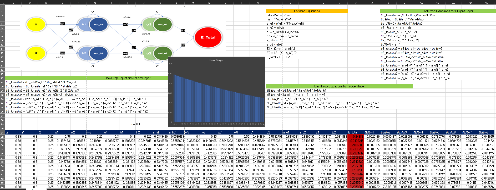
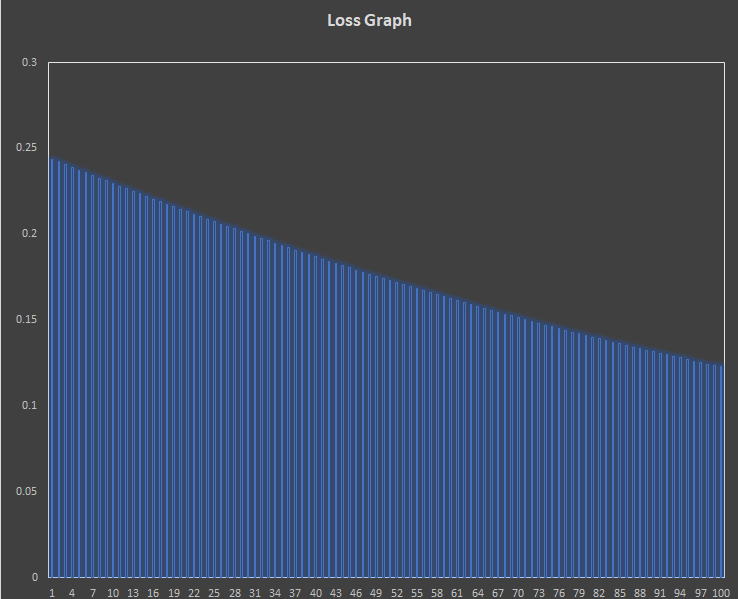
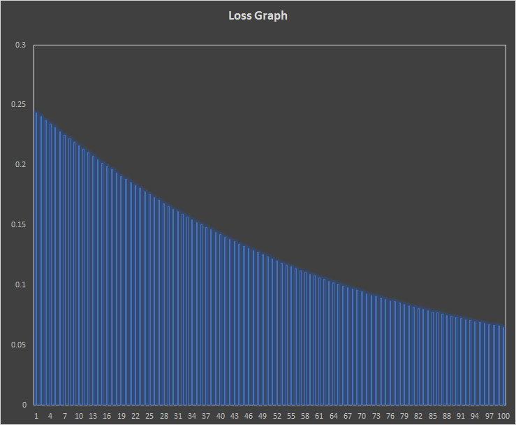
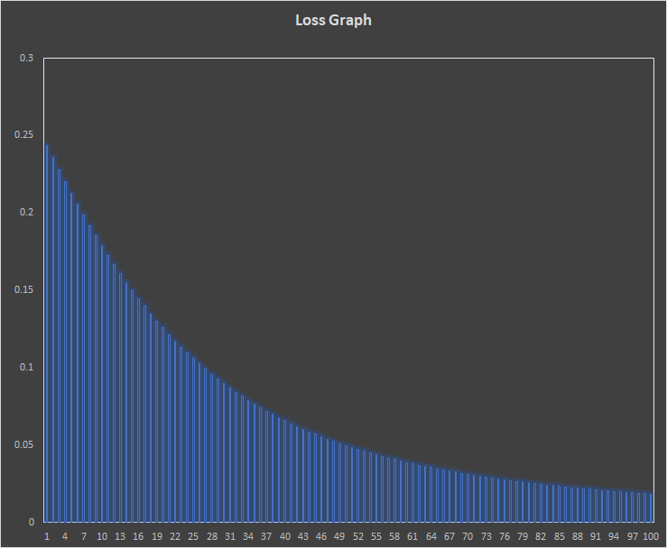
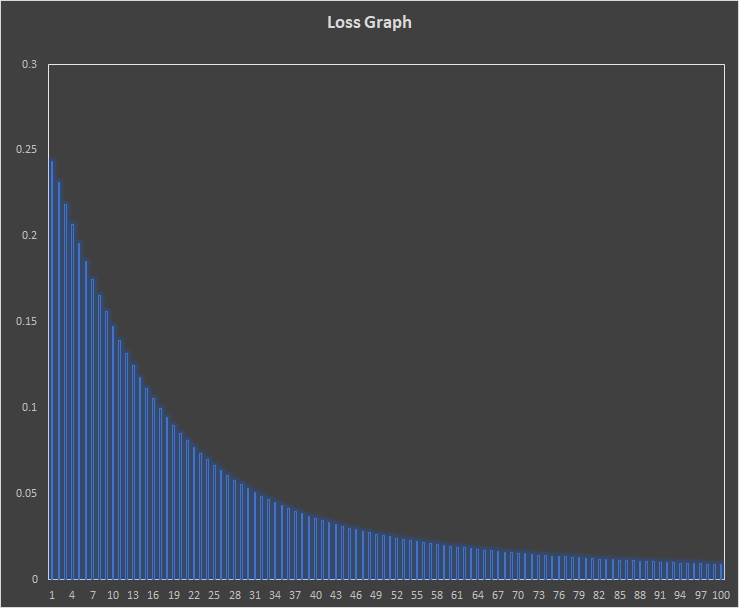
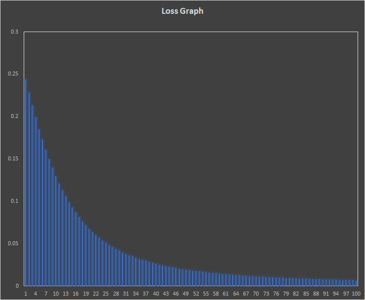
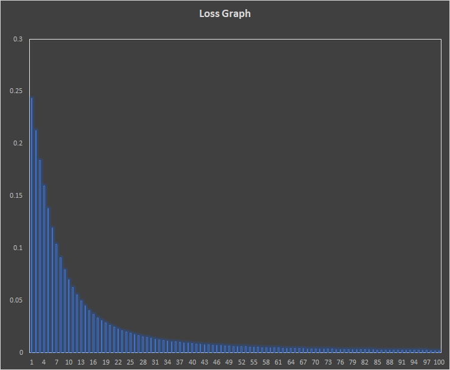

# BackPropagation and Neural Network Architecture Basics

## Part 1

Following is the snapshot of excel sheet describing the process of BackPropagation in Neural Network:

### Following are the charts for Loss when we used different Learning Rate (LR):

LR = 0.1           |  LR = 0.2
:-------------------------:|:-------------------------:
  |  

LR = 0.5           |  LR = 0.8
:-------------------------:|:-------------------------:
  |  

LR = 1.0          |  LR = 2.0
:-------------------------:|:-------------------------:
  |  

## Part 2

I have achieved the accuracy of 99.35 with parameter count  equal to 19958. Following, I have explained the model architecture and more details: